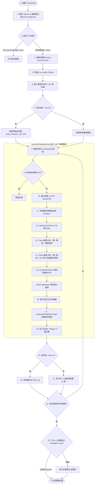

以下是針對 `js2ts-infer` 專案中 `generate` 核心重構管道（Pipeline）與 `ast-refactorer` 邏輯的深度架構剖析與優化建議報告。

---

# js2ts-infer 重構核心（cli generate）技術與架構分析報告

## 1. 核心重構管道流 (The Transformation Pipeline)

下列 Mermaid 流程圖完整呈現了 `js2ts-infer generate` 指令自執行起，經由配置載入、AST 兩階段收集與修改、型別雙向傳播、寬化，直至最終輸出寫入（或 Dry-Run 輸出 Diff）的全生命週期：



---

## 2. 程式碼核心技術與邏輯深度評估

### A. 「型別雙向傳播」與「寬化機制」演算法邏輯剖析

在 `ast-refactorer.ts` 中，型別傳播與寬化採用了**靜態與動態混合模式**：

1. **正向傳播 (Forward Propagation - 區域變數推導)**
   - **程式碼實現**：`src/ast-refactorer.ts` 內遍歷 Class methods 的 `VariableDeclaration` 節點。
   - **邏輯**：如果變數沒有顯式型別標記（`!decl.getTypeNode()`），且擁有初始化賦值表達式（`decl.getInitializer()`），則藉由 ts-morph 底層的 TypeScript Compiler API 調用 `init.getType()` 取得推導型別，經 `getCleanTypeText` 清洗後，呼叫 `decl.setType(typeText)` 標註。
   - **實例**：`var line = this.lines[i]` 藉由 `this.lines: Lines[]` 推導出 `line: Lines`。

2. **反向傳播 (Backward Propagation - 方法參數推導)**
   - **程式碼實現**：尋找 `this.methodName(args)` 調用表達式（`SyntaxKind.CallExpression`）。
   - **邏輯**：當偵測到在類別內部調用自身方法時，會比對引數（Arguments）在 AST 中的靜態型別。若目標方法（`targetMethod`）的對應參數尚未定義型別，則反向將該引數的推導型別寫入被呼叫方法的參數簽章中。
   - **實例**：`this.computePickupLength(this.lines, barLength)` 會將 `this.lines` 的推導型別傳遞給被呼叫函數 `computePickupLength(lines: Lines[], ...)`。

3. **回傳型別推導 (Return Type Deduction)**
   - **程式碼實現**：`resolveAndSetReturnType`。
   - **邏輯**：優先尋找該函式內的所有 `ReturnStatement`。如果所有 Return 語句的推導型別能夠被 `getCleanTypeText` 解析為合法型別（如 `Meter` 或 `Key | {}`），則將其作為聯合型別寫入函式傳回值。若 AST 無法推導，則調用 `typeDB` 動態側錄庫中的歷史回傳型別作為兜底。

4. **型別寬化機制 (Literal Widening)**
   - **程式碼實現**：`widenTypeName`。
   - **邏輯**：透過遞迴比對，若型別名稱為 `'true' | 'false'` 則擴大為 `'boolean'`；若為純數值字串擴大為 `'number'`；若為引號包裹字串擴大為 `'string'`。同時支援聯集型別（` | `）拆分寬化與去重，防堵型別因字面量（如 `0`、`"normal"`）而過度收窄（Over-narrowing）。

---

### B. 架構亮點評估

1. **唯讀收集與修改分離（Read-Collect-Modify Separate）設計**
   - **實作細節**：在 Class 屬性重構中，程式碼首先遍歷建構子 AST 收集符合資格的 `this.propName = rightText` 語句，並將待移動的屬性結構儲存於 `propertiesToMigrate` 陣列。**在此階段，完全不對 AST 進行任何結構修改**。收集完畢後，才統一呼叫 `cls.insertProperties(0, propertiesStructures)` 進行寫入，最後逆序（`for (let i = currentStatements.length - 1; i >= 0; i--)`）將建構子內多餘的賦值陳述式移除。
   - **優點**：完美規避了在遍歷 AST 子節點的同時修改父節點，導致 `ts-morph` 內部節點偏移或失效（Invalidated AST Nodes）的致命崩潰問題。

2. **多階層型別優先權設計（d.ts > AST > typeDB）**
   - 優先加載外部定義的 `.d.ts` 宣告檔，將其作為型別精準度對齊的「黃金標準」，隨後以 AST 語意推導傳播，最後 fallback 至動態觀測資料。這最大化地減少了 runtime 產生的臨時 `*Shape` 介面，使重構出的程式碼擁有極高的原生感。

---

### C. 潛在邊界漏洞 (Edge Case Bugs)

1. **同名內部介面衝突（Interface Duplication & Overwriting）**
   - **漏洞點**：當對多個檔案進行重構時，若不同檔案各自推導出了結構不同但名稱相同的 `*Shape`（例如 `AbctuneReturnShape`），在 `resolveParameterType` 中，這些暫存介面會儲存在各檔案的 `interfacesToDeclare` 局部變數中，並寫入各自檔案的頂部。若之後這些檔案互相引用，或是在全域編譯時，會引發 Interface 重複定義或成員衝突。
   - **邊界影響**：當專案規模增大、模組深度嵌套時，可能在編譯期拋出 `TS2300: Duplicate identifier` 錯誤。

2. **CommonJS 轉 ESM 後的 `require` 嵌套與動態載入遺漏**
   - **漏洞點**：在 `refactorCjsToEsm` 中，程式碼只對 SourceFile 頂層的 `VariableStatement` 進行 require 檢查：
     ```typescript
     if (stmt.getParent().getKind() !== SyntaxKind.SourceFile) return;
     ```
     如果程式碼中含有內嵌在函式內部（Lazy Load）的 `const dep = require('dep')`，或是動態 require `require(somePath)`，此語法將完全被跳過，且原 JS 代碼不會被轉譯為 ESM `import()`，這會導致轉譯後的 TS 檔案在執行期拋出 `require is not defined` 的 ReferenceError。

3. **`cleanCommentToJSDoc` 對複雜 JSDoc 格式的損毀**
   - **漏洞點**：在處理類別屬性註解提升時，`cleanCommentToJSDoc` 使用了正則替換：
     ```typescript
     comment.replace(/^\/\*\*+/, '').replace(/\*+\/$/, '').trim();
     ```
     如果原本的屬性上帶有包含多個 `@param` 或描述複雜的區塊註解，將其粗暴地轉換為單行文本，並重新以 `struct.docs` 寫入時，會導致原本排版精美的多行 JSDoc 毀損，變為一行雜亂的字串。

---

## 3. 專家級優化與程式碼演進建議

### A. 解決內部介面衝突方案
應在全域 `runGeneration` 控制器中建立一個**全域 Interface 註冊表**，確保所有自動生成的 `*Shape` 命名均具備專案級的唯一性（例如加入檔名雜湊字尾，或全域去重合併）。

### B. 支援非同步與動態 Import 重構
優化 `refactorCjsToEsm`，偵測非頂層的 require 語句，並將其重構為符合 ESM 規格的非同步 `import()`。

### C. 併發與 AST 效能提升
目前重構是以單執行緒同步遍歷所有檔案。針對大型專案，可以藉由多執行緒（Worker Threads）將檔案列表分片並行處理。

---

### D. 基於 ts-morph 的高品質重構虛擬碼 (Pseudo-code)

以下虛擬碼示範了如何透過優化**重寫動態/嵌套 `require`**，以及**全域 Interface 唯一性命名命名空間**以解決上述 Edge Cases：

```typescript
import { SourceFile, SyntaxKind, Project } from 'ts-morph';

/**
 * 專家級優化：動態/內嵌 require 重構為 ESM 動態 import
 */
function refactorNestedRequireToImport(sourceFile: SourceFile) {
  // 尋找檔案中所有的 require 呼叫表達式
  const callExpressions = sourceFile.getDescendantsOfKind(SyntaxKind.CallExpression);
  
  callExpressions.forEach(call => {
    const exprText = call.getExpression().getText();
    if (exprText === 'require') {
      const args = call.getArguments();
      if (args.length === 1) {
        const arg = args[0];
        
        // 判斷是否位於 SourceFile 頂層
        const isTopLevel = call.getFirstAncestorByKind(SyntaxKind.VariableStatement)
          ?.getParent()?.getKind() === SyntaxKind.SourceFile;
          
        if (!isTopLevel) {
          // 屬於嵌套或函式內 require，重構為 await import(arg)
          const moduleName = arg.getText();
          // 將 require('module') 替換為 import('module') 表達式
          call.replaceWithText(`import(${moduleName})`);
        }
      }
    }
  });
}

/**
 * 專家級優化：全域唯一性 Interface 命名產生器，防止 TS2300 重複宣告
 */
class GlobalInterfaceRegistry {
  private declaredNames = new Set<string>();

  public generateUniqueName(baseName: string, filePath: string): string {
    // 提取相對路徑的特徵字串作為雜湊前綴，避開點號與斜線
    const fileHash = filePath
      .replace(/\\/g, '/')
      .replace(/[^a-zA-Z0-9]/g, '')
      .slice(-6);
      
    let uniqueName = `${baseName}${fileHash}Shape`;
    let counter = 1;
    
    while (this.declaredNames.has(uniqueName)) {
      uniqueName = `${baseName}${fileHash}Shape${counter}`;
      counter++;
    }
    
    this.declaredNames.add(uniqueName);
    return uniqueName;
  }
}
```

---

## 4. AI 自我修正旁路 (Feedback Loop Bypass) 安全審查

目前 `src/code-generator.ts` 第 195 行對 `runFeedbackLoop` 的旁路設計如下：
```typescript
// 暫時關閉 TSC 診斷與 AI 反饋循環
// await runFeedbackLoop(targetDir, config);
```
### 審查結論：
此註解旁路**極度乾淨且無副作用**。
- `runFeedbackLoop` 僅在轉換管線的最後一步（所有檔案轉換落盤完成後）被調用，將其註解僅僅是跳過了二次修正的步驟，完全不影響前面四個重構與注入的核心邏輯。
- 所有在 `ast-refactorer.ts` 中產生的型別與 Interface 會照常寫入磁碟，程式碼不會因為此旁路關閉而殘留不完整的臨時狀態或引發 runtime 例外。
