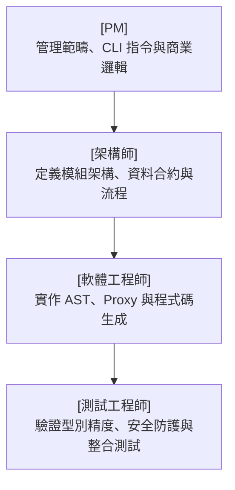

# AI Agent 開發指令書：JS → TS 執行時期型別輔助轉換工具 (`js2ts-infer`)

本文件專為 AI Agent 團隊（包含 **[PM]**、**[架構師]**、**[軟體工程師]**、**[測試工程師]**）設計，作為協同開發、實作、測試與驗證的唯一真理之源（Single Source of Truth）。

---

## 👥 角色職責與開發任務



---

## 📋 [PM] 需求規格與商業邏輯

### 1. 產品定位
開發一個 npm 樣式的 CLI 工具 `js2ts-infer`，透過**靜態流分析 (Static Flow)** 與**無侵入式動態代理 (Dynamic Proxy)** 的雙通道混合模式，全自動/半自動地將大型 JavaScript 專案重構為標準 TypeScript 專案。

### 2. 核心 CLI 指令規格
AI 軟體工程師必須實作以下 6 個 CLI 指令：
*   `npx js2ts-infer init`: 於專案目錄產生 `js2ts.config.json` 設定檔。
*   `npx js2ts-infer scan`: 掃描全專案，建立 Class 定義地圖並識別邊界 API/Exports，輸出 `boundary-map.json`。
*   `npx js2ts-infer run <command>`: 載入動態代理 Hook，執行測試或應用程式，啟動背景 HTTP 伺服器接收型別，輸出 `types-observed.json`。
*   `npx js2ts-infer merge <files...>`: 採用**增量合併 (Upsert)** 模式合併多份側錄的 JSON 檔案，處理型別聯集。
*   `npx js2ts-infer generate`: 結合靜態與動態型別，執行型別雙向傳播，自動將 CJS 重構為 ESM，並將型別注入原始碼。
*   `npx js2ts-infer review`: 在終端機啟動互動式 Review 介面，讓使用者以鍵盤選單補完剩餘的 `any` 與重命名 `interface`。

### 3. 商業決策約束 (Business Rules)
*   **型別寬度**：基礎型別一律推導為寬鬆型別（如 `string`、`number`），不啟用字面量聯集。
*   **註解處理**：不讀取現有的 JSDoc 型別，且現有程式碼中的 JSDoc 與普通註解必須**原樣保留**。
*   **安全防護**：執行 `generate` 前必須檢查 Git 狀態是否乾淨，否則拒絕執行；支援 `--dry-run` 輸出變更的 Diff Log。

---

## 📐 [架構師] 系統架構與資料合約

### 1. 無侵入式雙通道架構設計
本系統不直接在硬碟修改 JS 代碼進行插樁，而是採取記憶體攔截方案：

```
[原始 JS 檔案] ──(唯讀掃描)──> [Static Flow 分析] ──> 建立 Class 地圖 & boundary-map.json
      │
      ├─(Node.js 執行期) ──> 掛載 Require/ESM Loader Hook ──> 封裝為 Proxy ──┐
      │                                                                    ▼
      └─(瀏覽器執行期) ──> 動態注入全域 __typeTracker ──> 透過 HTTP POST ─> [HTTP Receiver]
                                                                           │
                                                                           ▼
                                                                  [types-observed.json]
```

### 2. 資料合約定義 (Data Contract)

#### A. 邊界地圖合約 (`boundary-map.json`)
```json
{
  "classes": {
    "AudioEngine": "src/core/audio.js",
    "UserSession": "src/models/user.js"
  },
  "boundaries": [
    {
      "filePath": "src/utils/math.js",
      "exportName": "add",
      "type": "function"
    }
  ]
}
```

#### B. 型別資料庫合約 (`types-observed.json`)
```json
{
  "src/user.js::processUser::param::user": {
    "observedTypes": [],
    "objectShapes": [
      {
        "id": "string",
        "score": "number"
      }
    ],
    "callCount": 10
  },
  "src/user.js::processUser::param::callback::cb_param::0": {
    "observedTypes": [ "Error", "null" ],
    "objectShapes": [],
    "callCount": 5
  }
}
```

---

## 💻 [軟體工程師] 實作指引與核心代碼

### 1. 核心動態代理（ESM / CJS Loader）實作
軟體工程師必須實作類似下方的攔截邏輯，重寫載入的 Module Exports：

```javascript
// 核心邊界代理包裝器
function createBoundaryProxy(target, modulePath, exportName) {
  return new Proxy(target, {
    get(obj, prop) {
      const val = Reflect.get(obj, prop);
      const trackerId = `${modulePath}::${exportName}::${prop}`;

      if (typeof val === "function") {
        return function (...args) {
          // 1. 側錄傳入參數
          args.forEach((arg, idx) => {
            globalThis.__typeTracker(`${trackerId}::param::${idx}`, arg);
          });
          
          // 2. 執行原函數
          const result = val.apply(this, args);
          
          // 3. 側錄回傳值
          globalThis.__typeTracker(`${trackerId}::return`, result);
          return result;
        };
      }
      return val;
    }
  });
}
```

### 2. 全域側錄器與 Callback 賦值重寫實作
當參數型別為 `function` (即 Callback) 時，必須將代理函數重新賦值回參數以追蹤回傳值：

```javascript
globalThis.__typeTracker = function (trackerId, value) {
  // 初始化資料庫結構...
  
  if (typeof value === "function") {
    if (value.__isWrapped) return value;

    const originalFn = value;
    const wrappedFn = function (...args) {
      // 側錄 Callback 入參
      args.forEach((arg, idx) => {
        globalThis.__typeTracker(`${trackerId}::cb_param::${idx}`, arg);
      });
      // 執行原 Callback
      const result = originalFn.apply(this, args);
      // 側錄 Callback 回傳值
      globalThis.__typeTracker(`${trackerId}::cb_return`, result);
      return result;
    };

    Object.defineProperty(wrappedFn, "__isWrapped", { value: true, enumerable: false });
    Object.assign(wrappedFn, originalFn);
    return wrappedFn; // 傳回代理，供呼叫端重新賦值
  }
  
  // 處理基本型別、Plain Object、Class 實例與 Promise...
};
```

---

## 🧪 [測試工程師] 驗證案例與測試規格

測試工程師必須針對以下場景編寫自動化測試與檢驗清單：

### 1. 測試案例 (Test Cases)

| 測試 ID | 驗證場景 | 預期結果 |
|:---|:---|:---|
| **TC-001** | `init` 指令執行 | 專案目錄下成功生成預設的 `js2ts.config.json` 且欄位完整。 |
| **TC-002** | 增量合併邏輯 | 合併包含 `observedTypes: ["string"]` 與 `["number"]` 的兩份報告，合併後應為 `["string", "number"]`，且 `callCount` 應累加。 |
| **TC-003** | 瀏覽器 Receiver | 模擬網頁發送 POST 請求傳回 `__typeDB`，背景伺服器應無損寫入 `types-observed.json`。 |
| **TC-004** | Git 安全防護 | 工作區有未 commit 檔案時執行 `generate` 應報錯中斷；加上 `--force` 可強制執行。 |
| **TC-005** | Dry Run 模式 | 帶有 `--dry-run` 執行時，硬碟檔案無任何修改，並在終端機輸出標準 diff 格式日誌。 |

### 2. QA 驗證查核清單 (Definition of Done)
- [ ] 執行 `tsc --noEmit` 通過編譯，無任何型別衝突噴錯。
- [ ] 原始碼中的所有 JSDoc 及自訂註解皆 100% 完整保留。
- [ ] 所有的 `module.exports` 與 `require` 皆被正確轉換為 `export` / `import`。
- [ ] 專案內部的 Class 實例型別皆已自動引入對應的 `import type { ClassName }`。
